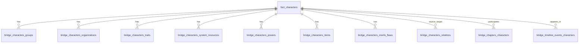
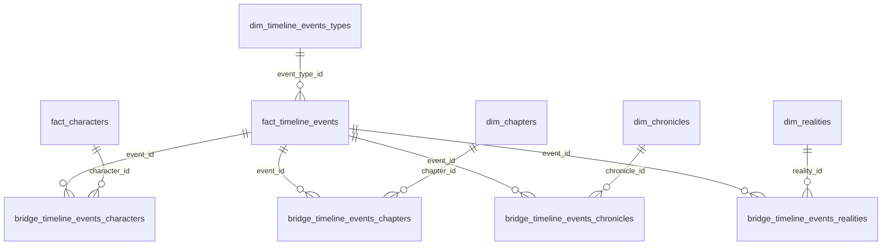

# Technical Documentation - Heaven's Gate

## 1. Scope
This document explains architecture, data model, table relationships, and operational guidelines for the Heaven's Gate codebase.

Primary schema references:

- `admin_upgrade_notes/dump-u807926597_hg-202603022117.sql` (latest reviewed dump)
- `bdd_structure.txt` (inventory snapshot)

For timeline insertion automation (LLM-ready):

- `admin_upgrade_notes/hg_timeline_events_howto.txt`

## 2. Application Architecture

- Entry point: `index.php`
- Router and route map: `app/bootstrap/body_work.php`
- DB bootstrap: `app/helpers/db_connection.php` (`config.env`, `mysqli`, `utf8mb4`)
- Main UI composition: navbar + route controller includes
- Admin dispatcher: `/talim?s=...` -> `app/controllers/admin/admin_main.php`

### 2.1 Timeline/Event routes (Operation Events 5.0)

- Main timeline page: `p=timeline` -> `app/controllers/main/events_main.php`
- Event detail page: `p=timeline_event` -> `app/controllers/main/events_page.php`
- Admin timeline module: `s=admin_timelines`
- Birthday quick admin module: `s=admin_birthdays_quick`

## 3. Database Modeling Strategy

- `dim_*`: dimensions/catalogs (reference entities)
- `fact_*`: content/state/events/business entities
- `bridge_*`: many-to-many relationships and active-state bridges

Main narrative hubs:

- `fact_characters`
- `fact_timeline_events` (expanded in Events 5.0)

### 3.1 Table counts (from dump-u807926597_hg-202603022117.sql)

- Total tables: 72
- `dim_*`: 33
- `fact_*`: 19
- `bridge_*`: 20

## 4. Core Relational Maps

The model is not a pure warehouse star. It is an operational domain model with two major hubs: character and timeline event.

### 4.1 Character-centric map (operational)

### 4.2 Timeline event map (Operation Events 5.0)

### 4.3 Relationship matrix (core domains)
| Domain | Hub table(s) | Main dimensions | Main bridge tables |
|---|---|---|---|
| Characters | `fact_characters` | players, chronicles, systems, breeds, auspices, tribes, totems, archetypes | groups, organizations, traits, resources, powers, items, merits/flaws, relations, chapters, timeline_events_characters |
| Timeline events | `fact_timeline_events` | timeline event types | timeline_events_characters, timeline_events_chapters, timeline_events_chronicles, timeline_events_realities |
| Systems/Rules | `dim_systems`, `dim_traits`, `fact_trait_sets`, `dim_systems_resources` | bibliographies, forms, breeds, auspices, tribes, misc | systems_resources_to_system |
| Powers | `fact_gifts`, `fact_rites`, `dim_totems`, `fact_discipline_powers` | gift/rite/totem/discipline types, systems, bibliographies | characters_powers |
| Chapters/Seasons | `dim_seasons`, `dim_chapters` | chronicles | chapters_characters, timeline_events_chapters, timeline_links (legacy) |
| Maps | `dim_maps`, `fact_map_pois`, `fact_map_areas` | map categories | - |
| Party tracker | `dim_parties`, `fact_party_members` | characters | party_members_changes |
| Soundtrack | `dim_soundtracks` | - | soundtrack_links |

## 5. Operational Guidelines

### 5.1 Character memberships
- Active Group: `bridge_characters_groups.is_active=1`
- Active Organization: `bridge_characters_organizations.is_active=1`
- Group/organization ownership: `bridge_organizations_groups`

### 5.2 Character sheet state
- Traits values: `bridge_characters_traits`
- System resources values: `bridge_characters_system_resources`
- Power links: `bridge_characters_powers`
- Inventory links: `bridge_characters_items`
- Merits/flaws links: `bridge_characters_merits_flaws`

### 5.3 Timeline events (post Events 5.0)
- Type source of truth: `fact_timeline_events.event_type_id` -> `dim_timeline_events_types.id`
- `fact_timeline_events.kind` remains LEGACY compatibility field
- `fact_timeline_events.timeline` remains LEGACY compatibility field
- Chronicle links must use `bridge_timeline_events_chronicles`
- Event ordering must use `sort_date` (fallback: `event_date`)
- Public timeline uses `is_active = 1` when column is present

### 5.4 Birthday canonical source
- Birthday is now represented as a timeline event of type `nacimiento`
- Character page birthday resolution now reads:
  - `bridge_timeline_events_characters`
  - `fact_timeline_events`
  - `dim_timeline_events_types` (`pretty_id='nacimiento'`)
- `fact_characters.birthdate_text` is now treated as migration/input support data

### 5.5 Timeline migration scripts
- `app/tools/migrate_timeline_events_phase1.php`
- `app/tools/migrate_timeline_events_bridges_phase2.php`
- `app/tools/migrate_timeline_birthdays_phase3.php`
- `app/tools/migrate_timeline_birthdays_text_phase4.php`

### 5.6 Logs/audit tables
- `bridge_characters_traits_log`
- `bridge_characters_system_resources_log`
- `fact_party_members_changes`

## 6. Full Data Dictionary (from bdd_structure.txt)
Note: timeline-related sections above (2.x, 4.2, 5.3, 5.4) reflect the latest dump and take precedence for the Events 5.0 domain.
Legend: PK=Primary Key, IDX=Indexed, NOT NULL as declared in source inventory.

### bridge_chapters_characters
| Column | Type | Flags |
|---|---|---|
| `id` | `int(11)` | [PK] [NOT NULL] |
| `chapter_id` | `int(11)` | [IDX] [NOT NULL] |
| `character_id` | `int(11)` | [IDX] [NOT NULL] |
| `created_at` | `timestamp` | [NOT NULL] |

### bridge_characters_groups
| Column | Type | Flags |
|---|---|---|
| `id` | `int(11)` | [PK] [NOT NULL] |
| `character_id` | `int(11)` | [IDX] [NOT NULL] |
| `group_id` | `int(11)` | [IDX] [NOT NULL] |
| `position` | `varchar(100)` | [NOT NULL] |
| `is_active` | `tinyint(1)` |  |
| `created_at` | `timestamp` | [NOT NULL] |
| `updated_at` | `timestamp` |  |

### bridge_characters_items
| Column | Type | Flags |
|---|---|---|
| `id` | `int(11)` | [PK] [NOT NULL] |
| `character_id` | `int(100)` | [IDX] [NOT NULL] |
| `item_id` | `int(100)` | [IDX] [NOT NULL] |
| `created_at` | `timestamp` | [NOT NULL] |
| `updated_at` | `timestamp` |  |

### bridge_characters_merits_flaws
| Column | Type | Flags |
|---|---|---|
| `id` | `int(11)` | [PK] [NOT NULL] |
| `character_id` | `int(100)` | [IDX] [NOT NULL] |
| `merit_flaw_id` | `int(11)` | [IDX] [NOT NULL] |
| `level` | `tinyint(2)` |  |
| `created_at` | `timestamp` | [NOT NULL] |
| `updated_at` | `timestamp` |  |

### bridge_characters_organizations
| Column | Type | Flags |
|---|---|---|
| `id` | `int(11)` | [PK] [NOT NULL] |
| `character_id` | `int(11)` | [IDX] [NOT NULL] |
| `clan_id` | `int(11)` | [IDX] [NOT NULL] |
| `is_active` | `tinyint(1)` |  |
| `role` | `varchar(100)` | [NOT NULL] |
| `created_at` | `timestamp` | [NOT NULL] |
| `updated_at` | `timestamp` |  |

### bridge_characters_powers
| Column | Type | Flags |
|---|---|---|
| `id` | `int(11)` | [PK] [NOT NULL] |
| `character_id` | `int(100)` | [IDX] [NOT NULL] |
| `power_kind` | `enum('dones','disciplinas','rituales')` | [NOT NULL] |
| `power_id` | `int(11)` | [NOT NULL] |
| `power_level` | `int(1)` | [NOT NULL] |
| `created_at` | `timestamp` | [NOT NULL] |
| `updated_at` | `timestamp` |  |

### bridge_characters_relations
| Column | Type | Flags |
|---|---|---|
| `id` | `int(11)` | [PK] [NOT NULL] |
| `source_id` | `int(11)` | [IDX] [NOT NULL] |
| `target_id` | `int(11)` | [IDX] [NOT NULL] |
| `relation_type` | `varchar(100)` | [NOT NULL] |
| `tag` | `varchar(100)` |  |
| `importance` | `int(11)` |  |
| `description` | `text` |  |
| `arrows` | `varchar(10)` |  |
| `created_at` | `timestamp` | [NOT NULL] |
| `updated_at` | `timestamp` |  |

### bridge_characters_system_resources
| Column | Type | Flags |
|---|---|---|
| `id` | `int(11)` | [PK] [NOT NULL] |
| `character_id` | `int(100)` | [IDX] [NOT NULL] |
| `resource_id` | `int(11)` | [IDX] [NOT NULL] |
| `value_permanent` | `int(11)` | [NOT NULL] |
| `value_temporary` | `int(11)` | [NOT NULL] |
| `created_at` | `timestamp` | [NOT NULL] |
| `updated_at` | `timestamp` |  |

### bridge_characters_system_resources_log
| Column | Type | Flags |
|---|---|---|
| `id` | `bigint(20) unsigned` | [PK] [NOT NULL] |
| `character_id` | `int(100)` | [IDX] [NOT NULL] |
| `resource_id` | `int(11)` | [IDX] [NOT NULL] |
| `old_permanent` | `int(11)` |  |
| `new_permanent` | `int(11)` |  |
| `old_temporary` | `int(11)` |  |
| `new_temporary` | `int(11)` |  |
| `delta_permanent` | `int(11)` |  |
| `delta_temporary` | `int(11)` |  |
| `reason` | `varchar(255)` |  |
| `source` | `varchar(50)` | [IDX] [NOT NULL] |
| `created_at` | `timestamp` | [NOT NULL] |
| `created_by` | `varchar(80)` |  |

### bridge_characters_traits
| Column | Type | Flags |
|---|---|---|
| `character_id` | `int(100)` | [PK] [NOT NULL] |
| `trait_id` | `int(11)` | [PK] [NOT NULL] |
| `value` | `tinyint(4)` | [NOT NULL] |
| `updated_at` | `timestamp` |  |

### bridge_characters_traits_log
| Column | Type | Flags |
|---|---|---|
| `id` | `bigint(20) unsigned` | [PK] [NOT NULL] |
| `character_id` | `int(100)` | [IDX] [NOT NULL] |
| `trait_id` | `int(11)` | [IDX] [NOT NULL] |
| `old_value` | `tinyint(4)` |  |
| `new_value` | `tinyint(4)` |  |
| `delta` | `smallint(6)` |  |
| `reason` | `varchar(255)` |  |
| `source` | `varchar(50)` | [NOT NULL] |
| `created_at` | `timestamp` | [NOT NULL] |
| `created_by` | `varchar(80)` |  |

### bridge_organizations_groups
| Column | Type | Flags |
|---|---|---|
| `id` | `int(11)` | [PK] [NOT NULL] |
| `clan_id` | `int(11)` | [IDX] [NOT NULL] |
| `group_id` | `int(11)` | [IDX] [NOT NULL] |
| `is_active` | `tinyint(1)` |  |
| `created_at` | `timestamp` | [NOT NULL] |
| `updated_at` | `timestamp` |  |

### bridge_soundtrack_links
| Column | Type | Flags |
|---|---|---|
| `id` | `int(11)` | [PK] [NOT NULL] |
| `soundtrack_id` | `int(11)` | [IDX] [NOT NULL] |
| `object_type` | `enum('personaje','temporada','episodio')` | [NOT NULL] |
| `object_id` | `int(11)` | [NOT NULL] |
| `created_at` | `timestamp` | [NOT NULL] |
| `updated_at` | `timestamp` |  |

### bridge_systems_resources_to_system
| Column | Type | Flags |
|---|---|---|
| `id` | `int(11)` | [PK] [NOT NULL] |
| `system_id` | `int(100)` | [IDX] [NOT NULL] |
| `resource_id` | `int(11)` | [IDX] [NOT NULL] |
| `sort_order` | `int(11)` | [NOT NULL] |
| `is_active` | `tinyint(1)` | [NOT NULL] |
| `created_at` | `timestamp` | [NOT NULL] |
| `updated_at` | `timestamp` |  |

### bridge_timeline_links
| Column | Type | Flags |
|---|---|---|
| `id` | `int(11)` | [PK] [NOT NULL] |
| `event_id` | `int(11)` | [IDX] [NOT NULL] |
| `relation_type` | `enum('capitulo','personaje')` | [NOT NULL] |
| `ref_id` | `int(11)` | [NOT NULL] |
| `updated_at` | `timestamp` |  |

### dim_archetypes
| Column | Type | Flags |
|---|---|---|
| `id` | `int(11)` | [PK] [NOT NULL] |
| `pretty_id` | `varchar(190)` |  |
| `name` | `varchar(100)` | [NOT NULL] |
| `description` | `longtext` | [NOT NULL] |
| `willpower_text` | `mediumtext` | [NOT NULL] |
| `bibliography_id` | `int(10) unsigned` | [IDX] |
| `created_at` | `timestamp` | [NOT NULL] |
| `updated_at` | `timestamp` |  |

### dim_auspices
| Column | Type | Flags |
|---|---|---|
| `id` | `int(11)` | [PK] [NOT NULL] |
| `pretty_id` | `varchar(190)` |  |
| `name` | `varchar(100)` | [NOT NULL] |
| `system_name` | `varchar(100)` | [NOT NULL] |
| `system_id` | `int(100)` | [IDX] |
| `energy` | `int(11)` | [NOT NULL] |
| `description` | `longtext` | [NOT NULL] |
| `image_url` | `longtext` | [NOT NULL] |
| `bibliography_id` | `int(10) unsigned` | [IDX] |
| `created_at` | `timestamp` | [NOT NULL] |
| `updated_at` | `timestamp` |  |

### dim_bibliographies
| Column | Type | Flags |
|---|---|---|
| `id` | `int(10) unsigned` | [PK] [NOT NULL] |
| `sort_order` | `int(3)` | [NOT NULL] |
| `name` | `varchar(100)` | [NOT NULL] |
| `year` | `int(4)` | [NOT NULL] |
| `publisher` | `varchar(100)` | [NOT NULL] |
| `description` | `longtext` | [NOT NULL] |
| `created_at` | `timestamp` | [NOT NULL] |
| `updated_at` | `timestamp` |  |

### dim_breeds
| Column | Type | Flags |
|---|---|---|
| `id` | `int(100)` | [PK] [NOT NULL] |
| `pretty_id` | `varchar(190)` |  |
| `name` | `varchar(100)` | [NOT NULL] |
| `system_name` | `varchar(100)` | [NOT NULL] |
| `system_id` | `int(100)` | [IDX] |
| `forms` | `varchar(100)` | [NOT NULL] |
| `energy` | `int(11)` | [NOT NULL] |
| `description` | `longtext` | [NOT NULL] |
| `image_url` | `longtext` | [NOT NULL] |
| `bibliography_id` | `int(10) unsigned` | [IDX] |
| `created_at` | `timestamp` | [NOT NULL] |
| `updated_at` | `timestamp` |  |

### dim_chapters
| Column | Type | Flags |
|---|---|---|
| `id` | `int(100)` | [PK] [NOT NULL] |
| `pretty_id` | `varchar(190)` |  |
| `name` | `varchar(100)` | [NOT NULL] |
| `chapter_number` | `int(10)` | [NOT NULL] |
| `season_number` | `int(10)` | [NOT NULL] |
| `synopsis` | `longtext` | [NOT NULL] |
| `played_date` | `date` |  |
| `in_game_date` | `date` |  |
| `created_at` | `timestamp` | [NOT NULL] |
| `updated_at` | `timestamp` |  |

### dim_character_types
| Column | Type | Flags |
|---|---|---|
| `id` | `int(100)` | [PK] [NOT NULL] |
| `pretty_id` | `varchar(190)` |  |
| `kind` | `varchar(100)` | [NOT NULL] |
| `sort_order` | `int(2)` | [NOT NULL] |
| `created_at` | `timestamp` | [NOT NULL] |
| `updated_at` | `timestamp` |  |

### dim_chronicles
| Column | Type | Flags |
|---|---|---|
| `id` | `int(10)` | [PK] [NOT NULL] |
| `name` | `varchar(100)` | [NOT NULL] |
| `description` | `longtext` | [NOT NULL] |
| `created_at` | `timestamp` | [NOT NULL] |
| `updated_at` | `timestamp` |  |

### dim_discipline_types
| Column | Type | Flags |
|---|---|---|
| `id` | `int(10)` | [PK] [NOT NULL] |
| `name` | `varchar(100)` | [NOT NULL] |
| `description` | `longtext` | [NOT NULL] |
| `created_at` | `timestamp` | [NOT NULL] |
| `updated_at` | `timestamp` |  |
| `pretty_id` | `varchar(190)` |  |

### dim_doc_categories
| Column | Type | Flags |
|---|---|---|
| `id` | `int(100)` | [PK] [NOT NULL] |
| `kind` | `varchar(100)` | [NOT NULL] |
| `sort_order` | `int(2)` | [NOT NULL] |
| `created_at` | `timestamp` | [NOT NULL] |
| `updated_at` | `timestamp` |  |

### dim_forms
| Column | Type | Flags |
|---|---|---|
| `id` | `tinyint(4)` | [PK] [NOT NULL] |
| `affiliation` | `varchar(100)` | [NOT NULL] |
| `race` | `varchar(30)` | [NOT NULL] |
| `system_id` | `int(100)` | [IDX] |
| `form` | `varchar(30)` | [NOT NULL] |
| `description` | `longtext` | [NOT NULL] |
| `image_url` | `longtext` | [NOT NULL] |
| `weapons` | `tinyint(1)` | [NOT NULL] |
| `firearms` | `tinyint(1)` | [NOT NULL] |
| `strength_bonus` | `varchar(10)` | [NOT NULL] |
| `dexterity_bonus` | `varchar(10)` | [NOT NULL] |
| `stamina_bonus` | `varchar(10)` | [NOT NULL] |
| `regeneration` | `tinyint(1)` | [NOT NULL] |
| `hpregen` | `int(10)` | [NOT NULL] |
| `bibliography_id` | `int(10) unsigned` | [IDX] |
| `created_at` | `timestamp` | [NOT NULL] |
| `updated_at` | `timestamp` |  |
| `pretty_id` | `varchar(190)` |  |

### dim_gift_types
| Column | Type | Flags |
|---|---|---|
| `id` | `int(100) unsigned` | [PK] [NOT NULL] |
| `pretty_id` | `varchar(190)` |  |
| `name` | `varchar(100)` | [NOT NULL] |
| `sort_order` | `int(2)` | [NOT NULL] |
| `determinant` | `varchar(100)` | [NOT NULL] |
| `description` | `longtext` | [NOT NULL] |
| `created_at` | `timestamp` | [NOT NULL] |
| `updated_at` | `timestamp` |  |

### dim_groups
| Column | Type | Flags |
|---|---|---|
| `id` | `int(11)` | [PK] [NOT NULL] |
| `pretty_id` | `varchar(190)` |  |
| `name` | `varchar(100)` | [NOT NULL] |
| `chronicle_id` | `int(10)` | [NOT NULL] |
| `totem_id` | `int(100)` | [NOT NULL] |
| `is_active` | `tinyint(1)` | [NOT NULL] |
| `description` | `longtext` | [NOT NULL] |
| `created_at` | `timestamp` | [NOT NULL] |
| `updated_at` | `timestamp` |  |

### dim_item_types
| Column | Type | Flags |
|---|---|---|
| `id` | `int(10)` | [PK] [NOT NULL] |
| `pretty_id` | `varchar(190)` |  |
| `name` | `varchar(100)` | [NOT NULL] |
| `sort_order` | `int(2)` | [NOT NULL] |
| `created_at` | `timestamp` | [NOT NULL] |
| `updated_at` | `timestamp` |  |

### dim_map_categories
| Column | Type | Flags |
|---|---|---|
| `id` | `int(11)` | [PK] [NOT NULL] |
| `name` | `varchar(80)` | [NOT NULL] |
| `slug` | `varchar(80)` | [NOT NULL] |
| `color_hex` | `char(7)` | [NOT NULL] |
| `icon` | `varchar(255)` |  |
| `sort_order` | `int(11)` | [IDX] |
| `created_at` | `timestamp` | [NOT NULL] |
| `updated_at` | `timestamp` | [NOT NULL] |

### dim_maps
| Column | Type | Flags |
|---|---|---|
| `id` | `int(11)` | [PK] [NOT NULL] |
| `name` | `varchar(120)` | [NOT NULL] |
| `slug` | `varchar(120)` | [NOT NULL] |
| `center_lat` | `decimal(9,6)` | [NOT NULL] |
| `center_lng` | `decimal(9,6)` | [NOT NULL] |
| `default_zoom` | `tinyint(3) unsigned` | [NOT NULL] |
| `min_zoom` | `tinyint(3) unsigned` |  |
| `max_zoom` | `tinyint(3) unsigned` |  |
| `bounds_sw_lat` | `decimal(9,6)` |  |
| `bounds_sw_lng` | `decimal(9,6)` |  |
| `bounds_ne_lat` | `decimal(9,6)` |  |
| `bounds_ne_lng` | `decimal(9,6)` |  |
| `default_tile` | `varchar(120)` |  |
| `created_at` | `timestamp` | [NOT NULL] |
| `updated_at` | `timestamp` | [NOT NULL] |

### dim_menu_items
| Column | Type | Flags |
|---|---|---|
| `id` | `int(11)` | [PK] [NOT NULL] |
| `parent_id` | `int(11)` |  |
| `menu_key` | `varchar(60)` |  |
| `label` | `varchar(120)` | [NOT NULL] |
| `href` | `varchar(255)` | [NOT NULL] |
| `icon` | `varchar(255)` |  |
| `icon_hover` | `varchar(255)` |  |
| `item_type` | `enum('static','dynamic','separator')` | [NOT NULL] |
| `dynamic_source` | `varchar(50)` |  |
| `sort_order` | `int(11)` | [NOT NULL] |
| `enabled` | `tinyint(1)` | [NOT NULL] |
| `target` | `enum('_self','_blank')` | [NOT NULL] |
| `css_class` | `varchar(120)` |  |
| `created_at` | `timestamp` | [NOT NULL] |
| `updated_at` | `timestamp` |  |

### dim_merits_flaws
| Column | Type | Flags |
|---|---|---|
| `id` | `int(11)` | [PK] [NOT NULL] |
| `pretty_id` | `varchar(190)` |  |
| `name` | `varchar(100)` | [IDX] [NOT NULL] |
| `kind` | `varchar(100)` | [NOT NULL] |
| `affiliation` | `varchar(100)` | [NOT NULL] |
| `cost` | `varchar(3)` | [NOT NULL] |
| `description` | `longtext` | [IDX] [NOT NULL] |
| `system_name` | `varchar(100)` | [NOT NULL] |
| `system_id` | `int(100)` | [IDX] |
| `bibliography_id` | `int(10) unsigned` | [IDX] |
| `created_at` | `timestamp` | [NOT NULL] |
| `updated_at` | `timestamp` |  |

### dim_organizations
| Column | Type | Flags |
|---|---|---|
| `id` | `int(11)` | [PK] [NOT NULL] |
| `sort_order` | `int(3)` | [NOT NULL] |
| `name` | `varchar(100)` | [NOT NULL] |
| `totem_id` | `int(100)` | [NOT NULL] |
| `system_name` | `varchar(100)` | [NOT NULL] |
| `color` | `varchar(7)` |  |
| `is_npc` | `tinyint(1)` | [NOT NULL] |
| `description` | `longtext` | [NOT NULL] |
| `created_at` | `timestamp` | [NOT NULL] |
| `updated_at` | `timestamp` |  |
| `pretty_id` | `varchar(190)` |  |

### dim_parties
| Column | Type | Flags |
|---|---|---|
| `id` | `int(11)` | [PK] [NOT NULL] |
| `name` | `varchar(255)` | [NOT NULL] |
| `description` | `text` |  |
| `active` | `tinyint(1)` | [NOT NULL] |
| `sort_order` | `int(11)` |  |
| `created_at` | `datetime` | [NOT NULL] |
| `updated_at` | `datetime` | [NOT NULL] |

### dim_players
| Column | Type | Flags |
|---|---|---|
| `id` | `int(11)` | [PK] [NOT NULL] |
| `pretty_id` | `varchar(190)` |  |
| `name` | `varchar(100)` | [NOT NULL] |
| `surname` | `varchar(100)` | [NOT NULL] |
| `picture` | `longtext` | [NOT NULL] |
| `description` | `longtext` | [NOT NULL] |
| `created_at` | `timestamp` | [NOT NULL] |
| `updated_at` | `timestamp` |  |

### dim_rite_types
| Column | Type | Flags |
|---|---|---|
| `id` | `int(100)` | [PK] [NOT NULL] |
| `sort_order` | `int(3)` | [NOT NULL] |
| `name` | `varchar(100)` | [NOT NULL] |
| `determinant` | `varchar(100)` | [NOT NULL] |
| `description` | `longtext` | [NOT NULL] |
| `created_at` | `timestamp` | [NOT NULL] |
| `updated_at` | `timestamp` |  |
| `pretty_id` | `varchar(190)` |  |

### dim_seasons
| Column | Type | Flags |
|---|---|---|
| `id` | `int(100)` | [PK] [NOT NULL] |
| `pretty_id` | `varchar(190)` |  |
| `name` | `varchar(100)` | [NOT NULL] |
| `season_number` | `int(10)` | [NOT NULL] |
| `sort_order` | `int(11)` |  |
| `season` | `tinyint(1)` | [NOT NULL] |
| `finished` | `tinyint(1)` |  |
| `description` | `longtext` | [NOT NULL] |
| `created_at` | `timestamp` | [NOT NULL] |
| `updated_at` | `timestamp` |  |

### dim_soundtracks
| Column | Type | Flags |
|---|---|---|
| `id` | `int(11)` | [PK] [NOT NULL] |
| `title` | `varchar(255)` | [NOT NULL] |
| `artist` | `varchar(255)` |  |
| `youtube_url` | `varchar(255)` |  |
| `context_title` | `varchar(255)` |  |
| `added_at` | `date` |  |
| `created_at` | `timestamp` | [NOT NULL] |

### dim_systems
| Column | Type | Flags |
|---|---|---|
| `id` | `int(100)` | [PK] [NOT NULL] |
| `pretty_id` | `varchar(190)` |  |
| `name` | `varchar(100)` | [NOT NULL] |
| `image_url` | `longtext` | [NOT NULL] |
| `sort_order` | `int(3)` | [NOT NULL] |
| `forms` | `tinyint(1)` | [NOT NULL] |
| `description` | `longtext` | [NOT NULL] |
| `bibliography_id` | `int(10) unsigned` | [IDX] |
| `created_at` | `timestamp` | [NOT NULL] |
| `updated_at` | `timestamp` |  |

### dim_systems_resources
| Column | Type | Flags |
|---|---|---|
| `id` | `int(11)` | [PK] [NOT NULL] |
| `pretty_id` | `varchar(190)` | [IDX] |
| `name` | `varchar(100)` | [IDX] [NOT NULL] |
| `kind` | `varchar(30)` | [IDX] [NOT NULL] |
| `sort_order` | `int(11)` | [NOT NULL] |
| `description` | `longtext` |  |
| `created_at` | `timestamp` | [NOT NULL] |
| `updated_at` | `timestamp` |  |

### dim_totem_types
| Column | Type | Flags |
|---|---|---|
| `id` | `int(11)` | [PK] [NOT NULL] |
| `sort_order` | `int(3)` | [NOT NULL] |
| `name` | `varchar(100)` | [NOT NULL] |
| `determinant` | `varchar(10)` | [NOT NULL] |
| `description` | `longtext` | [NOT NULL] |
| `created_at` | `timestamp` | [NOT NULL] |
| `updated_at` | `timestamp` |  |
| `pretty_id` | `varchar(190)` |  |

### dim_totems
| Column | Type | Flags |
|---|---|---|
| `id` | `int(11)` | [PK] [NOT NULL] |
| `pretty_id` | `varchar(190)` |  |
| `name` | `varchar(255)` | [NOT NULL] |
| `totem_type_id` | `int(3)` | [NOT NULL] |
| `cost` | `int(2)` | [NOT NULL] |
| `description` | `longtext` | [NOT NULL] |
| `traits` | `longtext` | [NOT NULL] |
| `prohibited` | `longtext` | [NOT NULL] |
| `image_url` | `longtext` | [NOT NULL] |
| `bibliography_id` | `int(10) unsigned` | [IDX] |
| `created_at` | `timestamp` | [NOT NULL] |
| `updated_at` | `timestamp` |  |

### dim_traits
| Column | Type | Flags |
|---|---|---|
| `id` | `int(11)` | [PK] [NOT NULL] |
| `pretty_id` | `varchar(190)` |  |
| `name` | `varchar(100)` | [IDX] [NOT NULL] |
| `kind` | `varchar(100)` | [NOT NULL] |
| `classification` | `varchar(100)` | [NOT NULL] |
| `description` | `longtext` | [IDX] [NOT NULL] |
| `levels` | `longtext` | [NOT NULL] |
| `posse` | `longtext` | [NOT NULL] |
| `special` | `longtext` | [NOT NULL] |
| `bibliography_id` | `int(10) unsigned` | [IDX] |
| `created_at` | `timestamp` | [NOT NULL] |
| `updated_at` | `timestamp` |  |

### dim_tribes
| Column | Type | Flags |
|---|---|---|
| `id` | `int(11)` | [PK] [NOT NULL] |
| `pretty_id` | `varchar(190)` |  |
| `name` | `varchar(100)` | [NOT NULL] |
| `system_name` | `varchar(100)` | [NOT NULL] |
| `system_id` | `int(100)` | [IDX] |
| `affiliation` | `varchar(100)` | [NOT NULL] |
| `energy` | `int(11)` | [NOT NULL] |
| `description` | `longtext` | [NOT NULL] |
| `powers` | `mediumtext` | [NOT NULL] |
| `image_url` | `longtext` | [NOT NULL] |
| `bibliography_id` | `int(10) unsigned` | [IDX] |
| `created_at` | `timestamp` | [NOT NULL] |
| `updated_at` | `timestamp` |  |

### fact_admin_posts
| Column | Type | Flags |
|---|---|---|
| `id` | `int(100)` | [PK] [NOT NULL] |
| `author` | `varchar(30)` | [NOT NULL] |
| `title` | `varchar(50)` | [NOT NULL] |
| `posted_at` | `date` | [NOT NULL] |
| `message` | `longtext` | [NOT NULL] |
| `created_at` | `timestamp` | [NOT NULL] |

### fact_characters
| Column | Type | Flags |
|---|---|---|
| `id` | `int(100)` | [PK] [NOT NULL] |
| `pretty_id` | `varchar(190)` |  |
| `name` | `varchar(50)` | [IDX] [NOT NULL] |
| `alias` | `varchar(20)` | [NOT NULL] |
| `garou_name` | `varchar(100)` | [NOT NULL] |
| `gender` | `varchar(1)` |  |
| `concept` | `varchar(50)` | [NOT NULL] |
| `chronicle_id` | `int(10)` | [NOT NULL] |
| `player_id` | `int(10)` | [NOT NULL] |
| `image_url` | `longtext` | [NOT NULL] |
| `text_color` | `varchar(100)` | [NOT NULL] |
| `character_kind` | `varchar(3)` | [NOT NULL] |
| `system_id` | `int(100)` | [IDX] |
| `totem_id` | `int(11)` | [IDX] |
| `status` | `varchar(30)` | [NOT NULL] |
| `cause_of_death` | `tinytext` | [IDX] [NOT NULL] |
| `character_type_id` | `int(10)` | [NOT NULL] |
| `breed_id` | `int(10)` | [NOT NULL] |
| `auspice_id` | `int(10)` | [NOT NULL] |
| `tribe_id` | `int(10)` | [NOT NULL] |
| `nature_id` | `int(10)` | [NOT NULL] |
| `demeanor_id` | `int(10)` | [NOT NULL] |
| `birthdate_text` | `varchar(50)` | [NOT NULL] |
| `rank` | `varchar(30)` | [NOT NULL] |
| `info_text` | `longtext` | [NOT NULL] |
| `notes` | `longtext` | [NOT NULL] |
| `is_abandoned` | `tinyint(1)` | [NOT NULL] |
| `created_at` | `datetime` | [NOT NULL] |
| `updated_at` | `timestamp` |  |

### fact_characters_comments
| Column | Type | Flags |
|---|---|---|
| `id` | `int(11)` | [PK] [NOT NULL] |
| `character_id` | `int(11)` | [NOT NULL] |
| `nick` | `varchar(25)` | [NOT NULL] |
| `comment_time` | `time` | [NOT NULL] |
| `commented_at` | `date` | [NOT NULL] |
| `message` | `mediumtext` | [NOT NULL] |
| `ip` | `varchar(50)` | [NOT NULL] |
| `created_at` | `timestamp` | [NOT NULL] |

### fact_combat_maneuvers
| Column | Type | Flags |
|---|---|---|
| `id` | `int(11)` | [PK] [NOT NULL] |
| `pretty_id` | `varchar(190)` |  |
| `image_url` | `varchar(190)` |  |
| `name` | `varchar(100)` | [NOT NULL] |
| `text` | `longtext` | [NOT NULL] |
| `user` | `varchar(100)` | [NOT NULL] |
| `roll` | `varchar(100)` | [NOT NULL] |
| `difficulty` | `varchar(100)` | [NOT NULL] |
| `damage` | `varchar(100)` | [NOT NULL] |
| `actions` | `varchar(100)` | [NOT NULL] |
| `system_name` | `varchar(100)` | [NOT NULL] |
| `system_id` | `int(100)` | [IDX] |
| `bibliography_id` | `int(10) unsigned` | [IDX] |
| `created_at` | `timestamp` | [NOT NULL] |
| `updated_at` | `timestamp` |  |

### fact_csp_posts
| Column | Type | Flags |
|---|---|---|
| `id` | `int(100)` | [PK] [NOT NULL] |
| `author` | `varchar(30)` | [NOT NULL] |
| `title` | `varchar(50)` | [NOT NULL] |
| `message` | `longtext` | [NOT NULL] |
| `posted_at` | `varchar(50)` |  |
| `created_at` | `timestamp` | [NOT NULL] |

### fact_dice_rolls
| Column | Type | Flags |
|---|---|---|
| `id` | `int(11)` | [PK] [NOT NULL] |
| `name` | `varchar(50)` | [NOT NULL] |
| `roll_name` | `varchar(50)` | [NOT NULL] |
| `dice_pool` | `int(11)` | [NOT NULL] |
| `difficulty` | `int(11)` | [NOT NULL] |
| `roll_results` | `text` | [NOT NULL] |
| `successes` | `int(11)` | [NOT NULL] |
| `botch` | `tinyint(1)` | [NOT NULL] |
| `ip` | `varchar(45)` | [NOT NULL] |
| `rolled_at` | `datetime` |  |
| `updated_at` | `timestamp` |  |

### fact_discipline_powers
| Column | Type | Flags |
|---|---|---|
| `id` | `int(11)` | [PK] [NOT NULL] |
| `pretty_id` | `varchar(190)` |  |
| `name` | `varchar(100)` | [NOT NULL] |
| `image_url` | `longtext` | [NOT NULL] |
| `disc` | `varchar(100)` | [NOT NULL] |
| `level` | `int(2)` | [NOT NULL] |
| `description` | `longtext` | [NOT NULL] |
| `system_name` | `longtext` | [NOT NULL] |
| `atributo` | `varchar(100)` | [NOT NULL] |
| `habilidad` | `varchar(100)` | [NOT NULL] |
| `bibliography_id` | `int(10) unsigned` | [IDX] |
| `created_at` | `timestamp` | [NOT NULL] |
| `updated_at` | `timestamp` |  |

### fact_docs
| Column | Type | Flags |
|---|---|---|
| `id` | `int(100)` | [PK] [NOT NULL] |
| `pretty_id` | `varchar(190)` |  |
| `section_id` | `int(100)` | [NOT NULL] |
| `title` | `varchar(150)` | [NOT NULL] |
| `content` | `longtext` | [NOT NULL] |
| `source` | `longtext` | [NOT NULL] |
| `bibliography_id` | `int(10) unsigned` | [IDX] |
| `created_at` | `timestamp` | [NOT NULL] |
| `updated_at` | `timestamp` |  |

### fact_gifts
| Column | Type | Flags |
|---|---|---|
| `id` | `int(100)` | [PK] [NOT NULL] |
| `pretty_id` | `varchar(190)` |  |
| `name` | `varchar(100)` | [IDX] [NOT NULL] |
| `image_url` | `varchar(190)` |  |
| `kind` | `varchar(50)` | [NOT NULL] |
| `gift_group` | `varchar(55)` | [NOT NULL] |
| `rank` | `varchar(25)` | [NOT NULL] |
| `attribute_name` | `varchar(50)` | [NOT NULL] |
| `ability_name` | `varchar(50)` | [NOT NULL] |
| `description` | `longtext` | [NOT NULL] |
| `system_name` | `longtext` | [NOT NULL] |
| `shifter_system_name` | `varchar(100)` | [NOT NULL] |
| `system_id` | `int(100)` | [IDX] |
| `bibliography_id` | `int(10) unsigned` | [IDX] |
| `created_at` | `timestamp` | [NOT NULL] |
| `updated_at` | `timestamp` |  |

### fact_items
| Column | Type | Flags |
|---|---|---|
| `id` | `int(100)` | [PK] [NOT NULL] |
| `pretty_id` | `varchar(190)` |  |
| `name` | `varchar(100)` | [IDX] [NOT NULL] |
| `item_type_id` | `int(10)` | [NOT NULL] |
| `level` | `int(2)` | [NOT NULL] |
| `gnosis` | `int(2)` | [NOT NULL] |
| `skill_name` | `varchar(50)` | [NOT NULL] |
| `damage_type` | `varchar(12)` | [NOT NULL] |
| `metal` | `tinyint(1)` | [NOT NULL] |
| `rating` | `tinyint(1)` | [NOT NULL] |
| `bonus` | `int(2)` | [NOT NULL] |
| `strength_req` | `int(2)` | [NOT NULL] |
| `dexterity_req` | `int(2)` | [NOT NULL] |
| `image_url` | `longtext` | [NOT NULL] |
| `description` | `longtext` |  |
| `bibliography_id` | `int(10) unsigned` | [IDX] |
| `created_at` | `timestamp` | [NOT NULL] |
| `updated_at` | `timestamp` |  |

### fact_map_areas
| Column | Type | Flags |
|---|---|---|
| `id` | `int(11)` | [PK] [NOT NULL] |
| `map_id` | `int(11)` | [IDX] [NOT NULL] |
| `category_id` | `int(11)` | [IDX] |
| `name` | `varchar(150)` | [NOT NULL] |
| `description` | `text` |  |
| `color_hex` | `char(7)` |  |
| `geometry` | `longtext` | [NOT NULL] |
| `created_at` | `timestamp` | [NOT NULL] |
| `updated_at` | `timestamp` | [NOT NULL] |

### fact_map_pois
| Column | Type | Flags |
|---|---|---|
| `id` | `int(11)` | [PK] [NOT NULL] |
| `name` | `varchar(255)` | [IDX] [NOT NULL] |
| `map_id` | `int(11)` | [IDX] [NOT NULL] |
| `category_id` | `int(11)` | [IDX] [NOT NULL] |
| `description` | `text` |  |
| `thumbnail` | `varchar(255)` |  |
| `latitude` | `decimal(9,6)` | [NOT NULL] |
| `longitude` | `decimal(9,6)` | [NOT NULL] |
| `created_at` | `timestamp` | [NOT NULL] |
| `updated_at` | `timestamp` | [NOT NULL] |
| `pretty_id` | `varchar(190)` |  |

### fact_misc_systems
| Column | Type | Flags |
|---|---|---|
| `id` | `int(11)` | [PK] [NOT NULL] |
| `pretty_id` | `varchar(190)` |  |
| `name` | `varchar(100)` | [NOT NULL] |
| `kind` | `varchar(100)` | [NOT NULL] |
| `system_name` | `varchar(100)` | [NOT NULL] |
| `system_id` | `int(100)` | [IDX] |
| `energy_name` | `varchar(100)` | [NOT NULL] |
| `energy_value` | `int(10)` | [NOT NULL] |
| `description` | `longtext` | [NOT NULL] |
| `extra_info` | `longtext` | [NOT NULL] |
| `created_at` | `timestamp` | [NOT NULL] |
| `updated_at` | `timestamp` |  |

### fact_party_members
| Column | Type | Flags |
|---|---|---|
| `id` | `int(11)` | [PK] [NOT NULL] |
| `plot_id` | `int(11)` | [IDX] [NOT NULL] |
| `base_char_id` | `int(11)` | [IDX] [NOT NULL] |
| `alias` | `varchar(255)` |  |
| `m_hp` | `int(11)` | [NOT NULL] |
| `m_rage` | `int(11)` |  |
| `m_gnosis` | `int(11)` |  |
| `m_glamour` | `int(11)` |  |
| `m_mana` | `int(11)` |  |
| `m_blood` | `int(11)` |  |
| `m_wp` | `int(11)` |  |
| `notes` | `text` |  |
| `active` | `tinyint(1)` | [NOT NULL] |
| `created_at` | `timestamp` | [NOT NULL] |
| `updated_at` | `timestamp` |  |

### fact_party_members_changes
| Column | Type | Flags |
|---|---|---|
| `id` | `int(11)` | [PK] [NOT NULL] |
| `plot_char_id` | `int(11)` | [IDX] [NOT NULL] |
| `resource` | `enum('hp','rage','gnosis','blood','glamour','mana','wp')` | [NOT NULL] |
| `value` | `int(11)` | [NOT NULL] |
| `notes` | `text` |  |
| `created_at` | `timestamp` | [NOT NULL] |

### fact_rites
| Column | Type | Flags |
|---|---|---|
| `id` | `int(100)` | [PK] [NOT NULL] |
| `pretty_id` | `varchar(190)` |  |
| `name` | `varchar(100)` | [NOT NULL] |
| `image_url` | `varchar(190)` |  |
| `kind` | `varchar(100)` | [NOT NULL] |
| `level` | `int(100)` | [NOT NULL] |
| `race` | `varchar(100)` | [NOT NULL] |
| `description` | `longtext` | [NOT NULL] |
| `system_text` | `longtext` | [NOT NULL] |
| `system_name` | `varchar(100)` | [NOT NULL] |
| `system_id` | `int(100)` | [IDX] |
| `bibliography_id` | `int(10) unsigned` | [IDX] |
| `created_at` | `timestamp` | [NOT NULL] |
| `updated_at` | `timestamp` |  |

### fact_timeline_events
| Column | Type | Flags |
|---|---|---|
| `id` | `int(11)` | [PK] [NOT NULL] |
| `event_date` | `date` | [NOT NULL] |
| `title` | `varchar(255)` | [NOT NULL] |
| `description` | `text` |  |
| `kind` | `enum('evento','catastrofe','batalla','descubrimiento','muerte','nacimiento','traicion','romance','fundacion','alianza','enemistad','reclutamiento','otros')` |  |
| `location` | `varchar(255)` |  |
| `source` | `varchar(255)` |  |
| `timeline` | `varchar(100)` |  |
| `created_at` | `timestamp` | [NOT NULL] |

### fact_trait_sets
| Column | Type | Flags |
|---|---|---|
| `system_id` | `int(100)` | [PK] [NOT NULL] |
| `trait_id` | `int(11)` | [PK] [NOT NULL] |
| `sort_order` | `int(11)` | [NOT NULL] |
| `is_active` | `tinyint(1)` | [NOT NULL] |
| `created_at` | `timestamp` | [NOT NULL] |
| `updated_at` | `timestamp` |  |

## 7. Recommended Query Patterns
- Use prepared statements for all user input.
- For active bridges, always filter `(is_active=1 OR is_active IS NULL)` where legacy rows may exist.
- Prefer `*_id` foreign keys over legacy text fields (`system_name`, `system_text`, etc.).
- For pretty URLs, resolve via `pretty_id` helpers then map to numeric `id` internally.

## 8. Schema Change Checklist
1. Add migration SQL and backup plan.
2. Update admin CRUD and public controllers.
3. Update route/pretty-id behavior if URL entities change.
4. Update this document and `README.md`.
5. Re-run data integrity checks (orphan bridges, invalid FK IDs, null critical fields).
